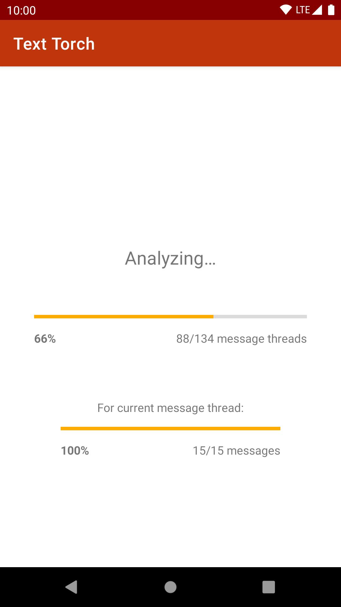
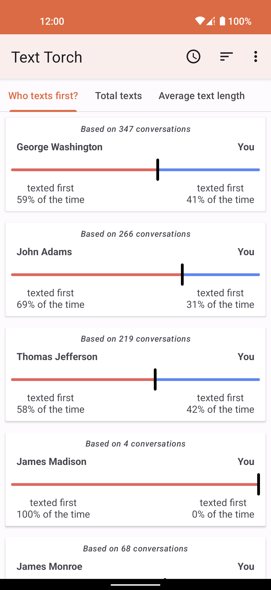
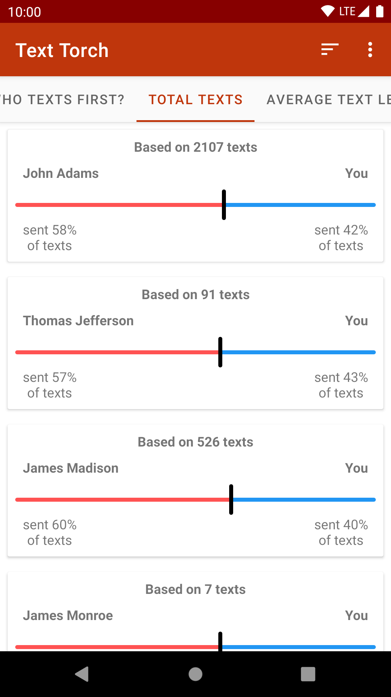
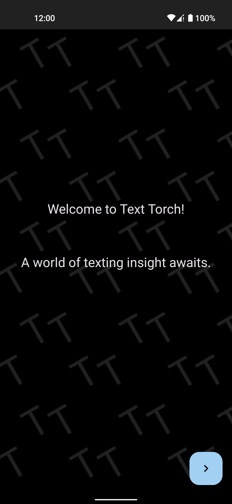

#  Text Torch  

 

Text Torch lets you shine a light on your texting behavior.

After it analyzes your SMS and MMS messages, you'll be told how you compare to each person you message in several ways:
- what percent of the time each of you starts conversations with the other
- what percent of the texts each of you has sent
- how the average length of your texts compares to theirs

## Screenshots

<table style="width: 100%">
<thead>
<tr>
<th>Intro</th>
<th>Analysis</th>
<th>Who texts first?</th>
<th>Total texts</th>
<th>Intro (dark mode)</th>
</tr>
</thead>
<tbody>
<tr>
<td width="20%"></td>
<td width="20%"></td>
<td width="20%"></td>
<td width="20%"></td>
<td width="20%"></td>
</tr>
</tbody>
</table>

## Why isn't Text Torch on Google Play?

Because as best as I can tell, it violates [Google Play policy](https://support.google.com/googleplay/android-developer/answer/9047303#invalid).

## What's next for Text Torch?

Here are some features I'd like to add at some point:
- Displaying how long each of the two people in a conversation takes, on average, to respond when the other person starts a conversation
  - Or maybe just how long each of the two people takes, on average, to respond to the other person's texts
- CSV export
- Doing…*something* when the cards that display data for each person are tapped (I'm not sure what yet 🤔)

## Donations

If you like the app enough that you want to send me a dollar or two, you can do that [here](https://paypal.me/mileskrell). To be clear, this probably **won't** speed up development of the app; development speed is really just limited by how much free time I have. But it'll certainly brighten up my day! 🙂

## License

Copyright (C) 2020 Miles Krell and the Text Torch contributors

Text Torch is licensed under the terms of the GNU General Public License, version 3 or later ("GPL-3.0-or-later"). See [COPYING](COPYING) for the full license text.
