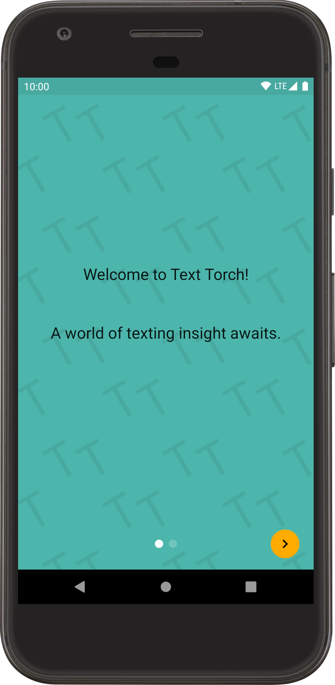
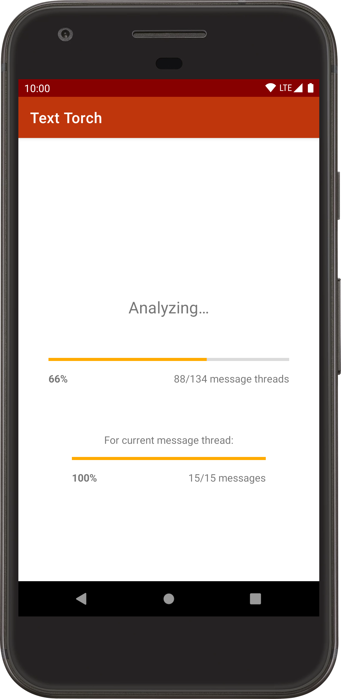
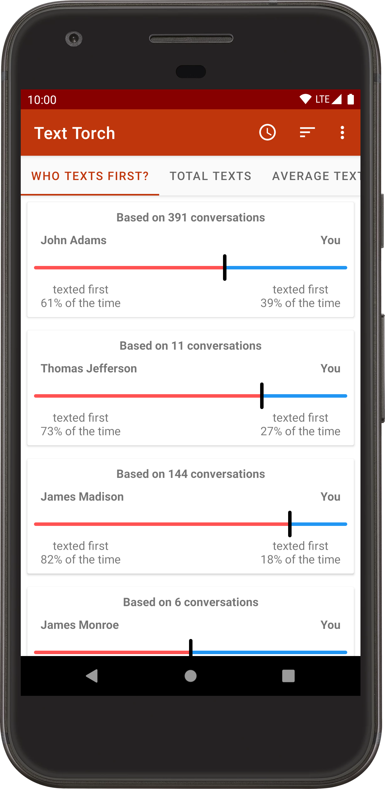
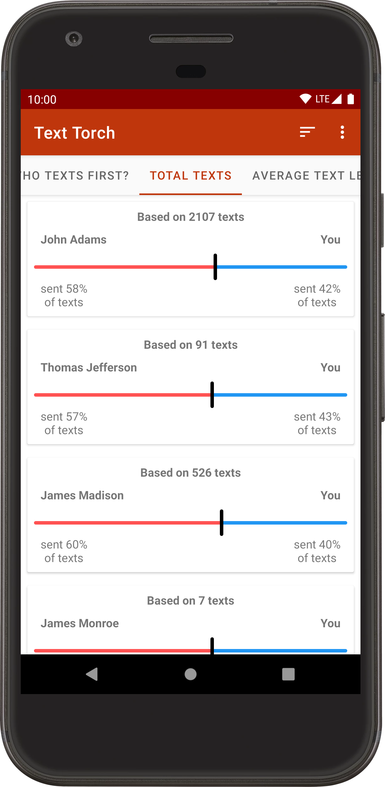
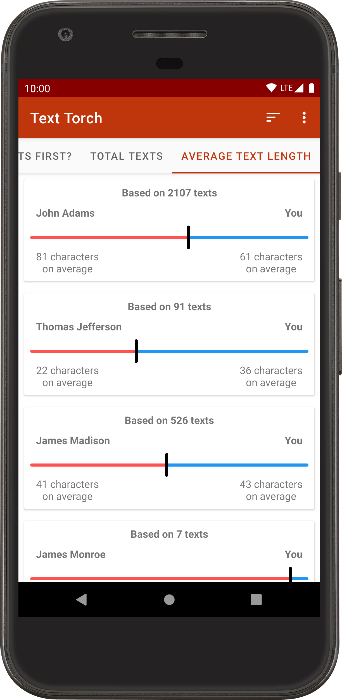

#  Text Torch  

Text Torch lets you shine a light on your texting behavior.

After it analyzes your SMS and MMS messages, you'll be told how you compare to each person you message in several ways:
- what percent of the time each of you starts conversations with the other
- what percent of the texts each of you has sent
- how the average length of your texts compares to theirs

## Screenshots

| Intro | Analysis | Who texts first? | Total texts | Average text length
|:-:|:-:|:-:|:-:|:-:|
 |  |  |  | 

## Why isn't Text Torch on Google Play?

Because as best as I can tell, it violates [Google Play policy](https://support.google.com/googleplay/android-developer/answer/9047303#invalid).

## What's next for Text Torch?

I'm fairly busy with school at the moment, but here are some features I'd like to add when I get the chance:
- Displaying how long each of the two people in a conversation takes, on average, to respond when the other person starts a conversation
  - Or maybe just how long each of the two people takes, on average, to respond to the other person's texts
- CSV export
- Doing…*something* when the cards that display data for each person are tapped (I'm not sure what yet 🤔)
- Eventually, making analytics opt-in. Right now, the app automatically reports crashes and tracks things such as how many messages and addresses it's analyzed. Why? Well, really just because it gives me some neat-looking numbers to put on my resume. Once that's no longer a concern, I plan to make it opt-in. I feel fine about tracking these metadata-type things, but if you don't, feel free to build your own version of the app with analytics disabled! (The fastest way to do that is to just remove the call to `SentryAndroid.init` in [App.kt](app/src/main/java/com/mileskrell/texttorch/App.kt).)

## Donations

If you like the app enough that you want to send me a dollar or two, you can do that [here](https://paypal.me/mileskrell). To be clear, this probably **won't** speed up development of the app; development speed is really just limited by how much free time I have. But it'll certainly brighten up my day! 🙂

## License

Copyright (C) 2020 Miles Krell and the Text Torch contributors

Text Torch is licensed under the terms of the GNU General Public License, version 3 or later ("GPL-3.0-or-later"). See [COPYING](COPYING) for the full license text.
